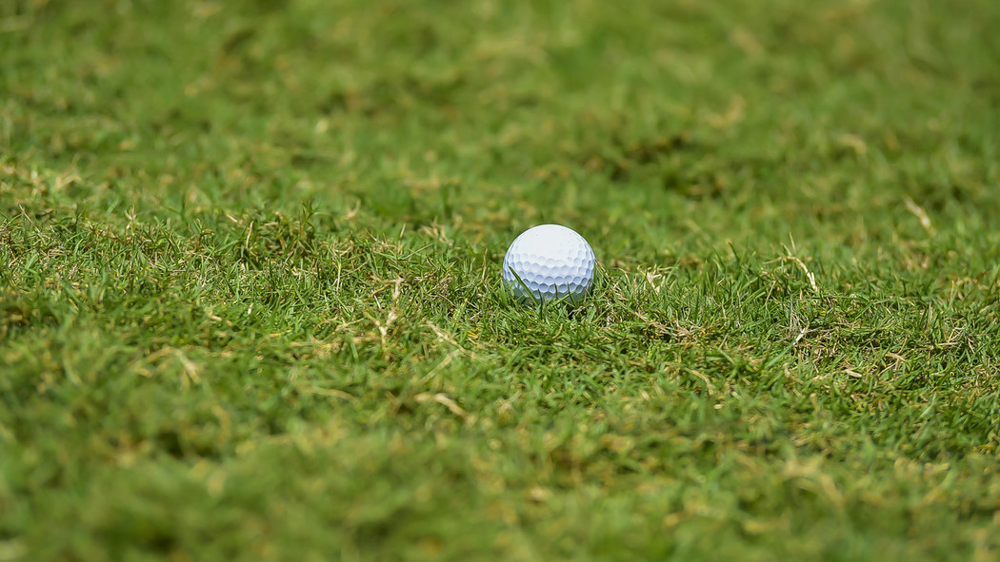
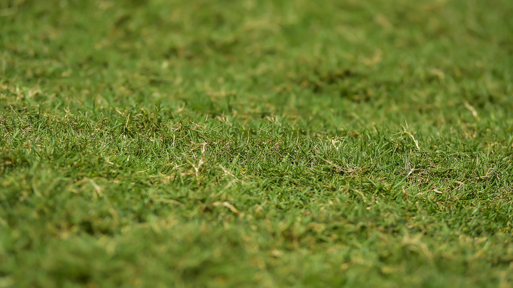

<div>
    </img>
    </img>
</div>

# Object Removal using Image Processing
### ✂️⚽🖼️  Object Removal without Machine Learning  
<br>
You can see the code running with more examples at the colab link below
<br>

<br>
<a href="https://colab.research.google.com/drive/1nUKN-GaAybqfMvW9VEaTTOUHxkCUNr4Q"></a>  

### Prerequisites
```
pip3 install opencv-contrib-python numpy
```
## Algorithm:
1. Crop image to location of the white ball.
2. Detect Ball within cropped image using Circle Hough and get its dimensions.
3. Convert cropped coordinates to lie within the full image.
4. Get a Sample area of the image to cover the hole.
5. Convert sample to HSV to measure Standard deviation.
6. Check if sample is valid based on Standard deviation and whether it lies within the image.
7. If sample is valid, blend sample in with background using inpainting.
8. If not valid, use inpainting to fill in hole.
9. Display before and after images.
